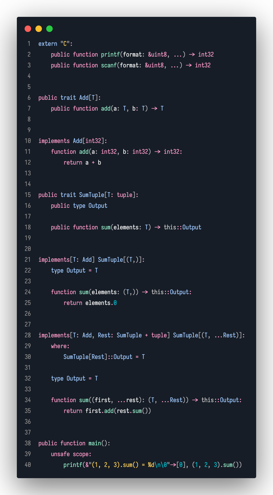

# Pernix Programming Language 


**Pernix** is a system-level programming language designed to provide memory
safety and a robust type system, similar to Rust.

## Example



## Try It Out

Download the latest releases from the GitHub releases page, or build it from
source.

To use the compiler, run the following command:

```bash
pernixc <source-file> -o out.o
cc out.o -o <output>
./<output>
```

Currently, the compiler outputs an object file that can be linked with a C
compiler. In the future, the compiler will be able to output an executable
directly.

> **Note**: The `cc` command is used to link the object file with a C compiler
> please ensure that you have a C compiler installed on your system or replace
> `cc` with the appropriate command for your system (e.g. MSVC's linker on
> Windows).

## Current Status

Pernix is currently in the early stages of development. The language is largely
a clone of Rust, but with a few differences 😄.

## Planned Features

These are some of the features that are planned for Pernix to be a fully
featured system-level programming language: (sorted by priority from high to
low)

-   Fully functional constant evaluation
-   Higher-order functions
-   Effect system
-   Standard library
-   Better LSP support
-   Documentation
